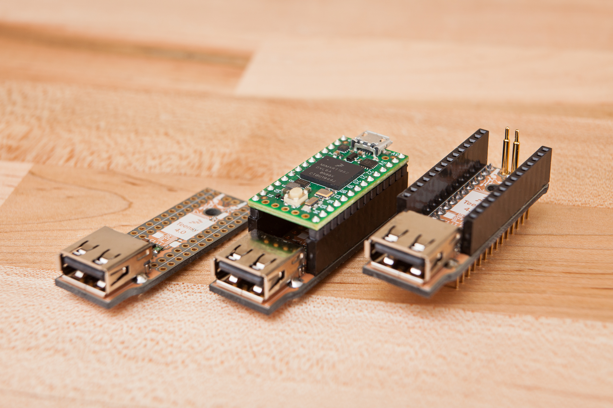

# Teensy 4.0 Minimalist USB Host Shield

This repository contains the KiCAD 6 board files for the [Teensy 4.0 minimalist USB host shield](https://www.partsnotincluded.com/teensy-4-0-minimalist-usb-host-shield). The shield is designed to connect to the underside of the Teensy 4.0 board and provide a safe and stable USB-A host port in a small and lightweight size.

The Teensy board needs to be soldered to 0.1" male headers. It can then be mated to the shield with 0.1" female headers and pogo pins, or soldered directly using enamel wire to connect to the data pads on the underside of the board.

For pogo pins, see the [PJRC Teensy 4.0 breakout board](https://www.pjrc.com/breakout-board-for-teensy-4-0/) page for reference. For my own boards I used 12 mm pogo pins purchased from RTLECS on AliExpress.

Generated gerbers and bill of materials can be found on the [releases](../../releases/latest) page.

## License

The KiCAD project files including the schematic, PCB design, symbols, and most footprints are released in the public domain with no rights reserved.

The [Parts Not Included](https://www.partsnotincluded.com/) logo, included on the bottom of the shield, is copyrighted. It may be reproduced as a silkscreen graphic in this project and its derivatives without modification.

Included images are licensed under the [CC BY-NC-ND 4.0 license](https://creativecommons.org/licenses/by-nc-nd/4.0/). Attribution should be to Dave Madison ([@dmadison](https://github.com/dmadison)).
